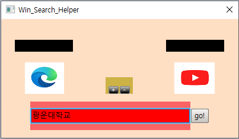

# Search-Lens

## 차례

- 프로그램 소개
- 다운로드 방법
- 사용법
- 주의사항
- 사용한 라이브러리, 프로그램 및 그림 출처
- 프로그램 빌드방법
- 라이센스

## 프로그램 소개

#### Search_Lens는 프로그램 하나로 간단하게 원하는 브라우저와 사이트를 골라 검색할 내용을 입력하면 바로 검색 결과 창을 띄워주는 프로그램입니다

# 다운로드 방법

1. github 화면에서 'Code'버튼을 누른 후 'Download ZIP'을 눌러 zip 파일을 다운받아줍니다.

2. 다운받은 압축 파일을 압축 해제합니다.

3. 압축 해제된 폴더에서 Search-Lens-main폴더로 들어간 뒤 Search_Lens.zip파일을 압축 해제합니다.

 

4. 압축 해제된 Search_Lens 폴더

5. Search_Lens 폴더 안에 있는 Search_Lens.exe 파일을 실행해주면 됩니다.

# 사용법

- ## 처음 실행하기

1. 처음 프로그램을 실행하면 뜨는 화면입니다.

2. 자신의 컴퓨터에 깔려있는 브라우저를 체크하고 'Ok'버튼을 눌러 초기 브라우저를 설정해줍니다.

3. 초기 설정이 완료된 모습

- ## 검색하기

    예시로'edge'에서 'youtube'에 '광운대학교'를 검색해보겠습니다.
  
1. 로봇의 왼쪽 눈썹을 눌러 브라우저를 선택합니다

2. 로봇의 오른쪽 눈썹을 눌러 사이트를 선택합니다

3. 로봇의 입을 클릭하고 로봇이 입을 벌리면 입 안에 검색어를 입력합니다

4. 로봇의 입 옆에 'go!' 버튼을 누르면 검색이 됩니다

5. 검색이 완료된 모습

- ## 브라우저 추가/삭제하기

  ### 브라우저 추가하기

1. 브라우저 'chrome'을 추가하기 전의 모습

2. 로봇의 코에 +버튼을 누릅니다

3. 'Add_setting' 창에서 왼쪽 큰 창에 브라우저의 확장자를 제외한 파일명을  입력합니다

4. 'add browser' 버튼을 클릭하고 성공이라는 창이 뜨면 추가가 완료됩니다

5. 새로운 브라우저 'chrome'이 추가된 모습

  ### 브라우저 삭제하기

1. 브라우저 'chrome'을 삭제하기 전의 모습

2. 로봇의 코의 -버튼을 누릅니다

3. 'Select the browser'에서 'chrome'을 선택합니다

 

4. 'del browser' 버튼을 클릭하고 성공이라는 창이 뜨면 삭제가 완료됩니다

5. 브라우저 'chrome'을 삭제한 후 모습

- ## 사이트 추가/삭제하기

  ### 사이트 추가하기

    예시로 네이버 웹툰 검색 사이트를 추가해보겠습니다

1. 로봇의 코의 +을 누릅니다	

2. 웹툰 홈페이지에 들어갑니다

3. 검색창에 검색어를 입력한 후 URL에서 검색어를 제외한 URL을 복사합니다

4. 'Type the name of website'에는 본인이 원하는 이름을, 'Type the website's search URL'에는 아까 복사한 URL을 붙여넣습니다

5. 'add wedsite'버튼을 누른 후 지정한 대로 'webtoon'이 추가된 모습

  
  ### 사이트 삭제하기

1. 로봇의 코의 -를 누릅니다 

2. 삭제를 원하는 사이트를 목록에서 선택합니다

3. 'del website'버튼을 누른 후 'webtoon'이 삭제된 모습

 
# 주의사항

  - txts폴더 수정금지
  - browser_icon, website_icon 폴더 수정금지
  위 파일들을 수정했을 때 프로그램 오류가 발생할 수 있습니다.
  - .exe 실행 파일과 txts, browser_icon, website_icon 폴더는 반드시 동일한 디렉터리에 존재해야 합니다.
  - 띄어쓰기를 인식 못하기 때문에 띄어쓰기를 하지 않고 검색해주세요.
  - 브라우저를 추가할 때에는 브라우저의 파일명을 정확하게 기재하셔야 합니다.
  (예시 : 크롬의 파일명은 chrome.exe 이므로 chrome 입력, 마이크로소프트 엣지의 파일명은 msedge.exe이므로 msedge 입력)

# 사용한 라이브러리, 프로그램 및 출처

GUI만드는데 사용한 라이브러리

nana library
Link : [nana library][naliblink]

[naliblink]: http://nanapro.org/en-us/ "nana library"

nana library를 사용해 GUI를 편리하게 편집하게 해주는 프로그램

nana creator 
LinK : [nana creator][nacrealink]

[nacrealink]: https://github.com/besh81/nana-creator "nana creator"

실행 파일 아이콘 출처: 만화 "우에키의 법칙"

# 프로젝트 수정방법

nana library가 빌드되어 있는 환경(비주얼 스튜디오 프로젝트 등)에 소스 파일, 헤더 파일을 다운받아 넣은 뒤 수정하면 됩니다.

# 라이센스

    -[MIT License](https://opensource.org/licenses/MIT)
    -[Boost Software License(Nana Library](https://www.boost.org/LICENSE_1_0.txt)
    -[GNU General Public License v3.0(nana creator)](https://github.com/besh81/nana-creator/blob/master/LICENSE)

	
